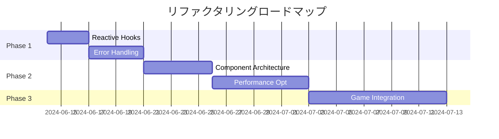

# リファクタリングタスク一覧

このディレクトリには、POCから本格的なゲーム開発フレームワークへと進化させるためのタスクが含まれています。

## タスクの優先順位

### 🔴 Critical（ゲーム開発の基盤）
1. **[01-reactive-hooks-refactor.md](./01-reactive-hooks-refactor.md)**
   - 依存配列パターンの実装
   - 現在の冗長なSignal同期を解消
   - 推定工数: 2-3日

2. **[03-error-handling-debugging.md](./03-error-handling-debugging.md)**
   - エラーハンドリングの統一
   - デバッグツールの実装
   - 推定工数: 3-4日

### 🟡 Important（品質とスケーラビリティ）
3. **[02-component-architecture.md](./02-component-architecture.md)**
   - コンポーネントの再設計
   - トレイトベースの境界設計
   - 推定工数: 4-5日

4. **[04-performance-optimization.md](./04-performance-optimization.md)**
   - 60FPS達成のための最適化
   - メモリ効率の改善
   - 推定工数: 5-7日

### 🟢 Enhancement（ゲーム固有機能）
5. **[05-game-ready-integration.md](./05-game-ready-integration.md)**
   - ゲームループ実装
   - ECS統合
   - 推定工数: 7-10日

## ロードマップ



## なぜこの順序か

### Phase 1: 基盤の安定化（1-2週間）
- **リアクティブフック**: 今後全ての開発の土台
- **エラーハンドリング**: デバッグ効率が劇的に向上

### Phase 2: アーキテクチャ改善（2-3週間）
- **コンポーネント設計**: スケーラブルな構造へ
- **パフォーマンス**: ゲーム品質の実現

### Phase 3: ゲーム機能実装（2-3週間）
- **統合実装**: 実際のゲーム開発が可能に

## 成功指標

### 技術的指標
- ✅ 依存管理の冗長性が解消
- ✅ エラーが適切に処理・表示される
- ✅ 10万オブジェクト @ 60FPS
- ✅ メモリリークなし（15分連続動作）

### 開発体験指標
- ✅ React開発者が違和感なく開発可能
- ✅ デバッグ時間が50%削減
- ✅ 新機能追加が1日以内で可能

### ビジネス指標
- ✅ プロトタイプ作成: 1日
- ✅ MVP開発: 1週間
- ✅ 本番リリース: 1ヶ月

## 各タスクの依存関係

```
01-reactive-hooks
    ↓
03-error-handling ← 02-component-architecture
    ↓                       ↓
04-performance-optimization
    ↓
05-game-ready-integration
```

## 実装時の注意点

1. **段階的な移行**
   - 既存機能を壊さない
   - テストカバレッジを維持
   - パフォーマンス劣化を防ぐ

2. **ドキュメント優先**
   - APIドキュメントを先に書く
   - 使用例を必ず含める
   - 移行ガイドを用意

3. **継続的な検証**
   - 各Phaseでベンチマーク実施
   - ユーザビリティテスト
   - メモリプロファイリング

## 関連ドキュメント
- [プロジェクトREADME](../../README.md)
- [アーキテクチャ設計書](../architecture.md)（作成予定）
- [API リファレンス](../api-reference.md)（作成予定）

## 質問・相談
実装で迷った場合は、以下の観点で判断：
1. ゲーム開発で本当に必要か？
2. パフォーマンスへの影響は？
3. 開発体験は向上するか？

より複雑なゲーム開発への懸念を解消し、技術的な挑戦を楽しみましょう！